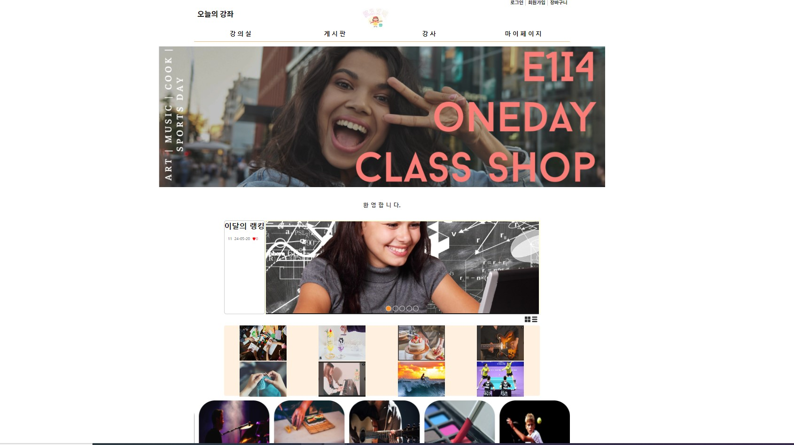
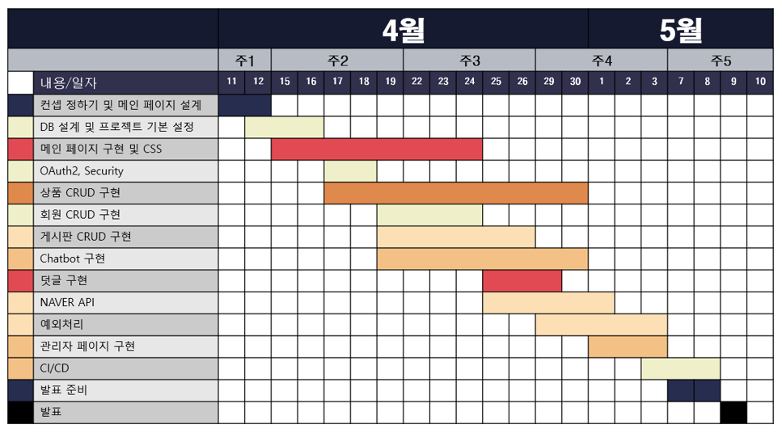

# 😀이건표 1차 프로젝트

### 🛒쇼핑몰 & 관리자 모드 기반 ChatBot 구현

# 🌟 **● 프로젝트 명** : E 1 I 4 🌟

#### **● 프로젝트 설명** : 원데이 클래스 강의 쇼핑몰 사이트

## 개요 ✨
이 프로젝트는 평범한 물품 판매 사이트와 달리 강의 중심의 쇼핑몰 사이트를 구축하는 것을 목표로 하였습니다. 사용자 경험을 중시하며, 사용자의 지속적인 참여와 관리가 가능하도록 설계되었습니다.

## 목차 📚
- [프로젝트 배경](#프로젝트-배경-)
- [프로젝트 일정](#프로젝트-일정-)
- [팀원구성 및 역할](#팀원구성-및-역할-)
- [기술 스택](#기술-스택-)
- [주요 기능](#주요-기능-)
- [기능시연 영상](#기능시연-영상-)
- [향후 개선 사항](#향후-개선-사항-)

## 프로젝트 배경 📜
> 사용자에게 참신하고 편리한 서비스를 제공하기 위해 사용자 경험을 중심으로 한 웹사이트 디자인,
>
> 사용자와 관리자 간의 원활한 커뮤니케이션을 가능하게 하는 챗봇 시스템 등
>
> 더 투명하고 신뢰할 수 있는 정보를 제공하여 적극적인 참여를 유도하였다.

## 프로젝트 일정 🗓️
 

## 팀원구성 및 역할 👥
- **(팀장) 박ㅇㅇ**: DB설계, 회원 CRUD, OAuth2, Security, CI/CD
- **(팀원) 심ㅇㅇ**: 게시판 CRUD (커뮤니티, 공지사항, 수강후기), NAVER API
- **(팀원) 손ㅇㅇ**: 관리자 페이지, Chatbot, 강사소개 페이지, 메뉴바, INDEX 애니메이션 기능
- **(팀원) 이건표**: 상품 CRUD, 장바구니 담당
- **(팀원) 조ㅇㅇ**: INDEX 페이지, 1:1 문의내역, NAVER API

## 기술 스택 🛠

- **프로젝트명**: E1i4TeamProject
- **프로그래밍 언어**: JAVA
- **프레임워크**: Springboot 2.7.11
- **라이브러리**: Spring WEB(MVC), Thymeleaf, Spring Data JPA, Lombok, SpringSecurity5, websocket, validation, OAuth2, security
- **데이터베이스**: MySql8
- **ORM**: Spring Data JPA (JAVA(SQL))
- **개발툴**: IntelliJ
- **템플릿 엔진**: Thymeleaf (HTML + Data)
- **빌드**: Gradle
- **설정**: application.yml, application-oauth2.yml

## 주요 기능 🚀
### SHOP(CRUD)
| NO | 기능         | 설명                                                                 |
|----|--------------|----------------------------------------------------------------------|
| 1  | 게시판작성   | 클래스를 미술, 체육, 음악, 요리 카테고리로 분류 선생님명은 회원닉네임으로 자동표기 파일선택으로 게시글 사진추가 |
| 2  | 게시판조회   | 게시글 상세 조회 가능 게시글을 좋아요를 눌러 찜 가능 게시글 조회수 추가 게시글 댓글 기능 추가 작성 및 삭제 구현 수량 체크 후 개수만큼 장바구니로 이동 구현 |
| 3  | 게시판수정   | 제목, 내용, 카테고리, 금액, 인원, 사진 수정 가능                     |
| 4  | 게시판삭제   | 본인이 작성한 게시글만 삭제 가능                                     |
| 5  | 게시판좋아요 | 토글 방식으로 게시글당 한 번만 좋아요 가능 다시 누를 경우 취소 구현 좋아요를 통해 메인페이지에 이달의 랭킹 순위에 게시글 표시 |
| 6  | 게시판조회수 | 조회수 기능 추가, 게시글 한 번 들어갈 때마다 +1                     |

### CART
| NO | 기능           | 설명                                                   |
|----|----------------|--------------------------------------------------------|
| 1  | 장바구니 생성  | 게시판에서 장바구니 담기 누르면 카트 자동 생성        |
| 2  | 장바구니 삭제  | 장바구니에서 개별 목록 삭제와 전체 삭제 기능 구현     |
| 3  | 장바구니 조회  | 장바구니로 이동 시 자기가 담은 장바구니 리스트 확인 가능 |

## 기능시연 영상 🎬

### 상점게시판 작성시연 영상

### 댓글작성 및 삭제

### 게시판 수정 삭제

### 페이징 서치

### 좋아요 기능

### 장바구니

### 메인페이지 Top Like 순

## 향후 개선 사항 🔧
프로젝트 처음 시작할 때는 시간이 많은 줄 알았습니다. 첫 프로젝트이기도 하고, 우리 팀원들이 욕심이 많아서 하고 싶은 것들이 많다 보니 생각보다 구현하지 못한 것이 많고, 더 예쁘게 할 수 있었는데 시간에 쫓겨서 포기한 것이 많아서 아쉽습니다. 사용자들에게 더 편리한 쇼핑몰 게시판으로 구현하고 싶습니다.

**[⬆ 위로 가기](#이건표-1차-프로젝트)**